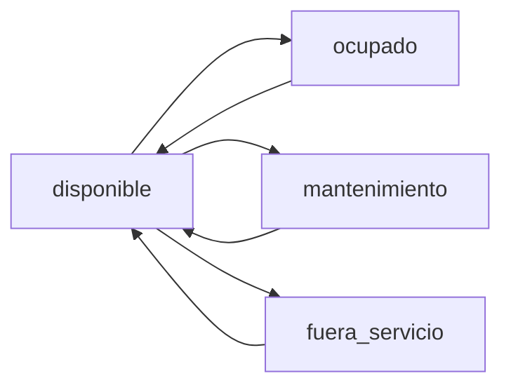
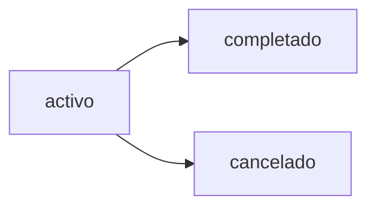

# Guía de Integración Frontend - Sistema de Bahías de Servicio

Esta guía proporciona toda la información necesaria para integrar el Sistema de Bahías de Servicio con el frontend de la aplicación.

## 📋 Tabla de Contenidos

1. [Resumen del Sistema](#resumen-del-sistema)
2. [Autenticación](#autenticación)
3. [Endpoints Disponibles](#endpoints-disponibles)
   - [1. Gestión de Bahías](#1-gestión-de-bahías)
   - [2. Gestión de Asignaciones (Entrada/Salida)](#2-gestión-de-asignaciones-entradasalida)
   - [3. Dashboard y Reportes](#3-dashboard-y-reportes)
4. [Modelos de Datos](#modelos-de-datos)
5. [Flujos de Trabajo](#flujos-de-trabajo)
6. [Ejemplos de Integración](#ejemplos-de-integración)
7. [Manejo de Errores](#manejo-de-errores)
8. [Estados y Transiciones](#estados-y-transiciones)

---

## 🎯 Resumen del Sistema

El Sistema de Bahías de Servicio permite gestionar:

- **Bahías de servicio** (puestos de trabajo en el taller)
- **Asignaciones de técnicos** a bahías y órdenes de trabajo
- **Seguimiento de tiempos** de entrada/salida
- **Reportes** de utilización y horas trabajadas
- **Historial** de ocupación de bahías

---

## 🔐 Autenticación

Todos los endpoints requieren autenticación JWT.

### Header requerido:

```http
x-token: YOUR_JWT_TOKEN
```

### Obtener token:

```javascript
// POST /api/auth/login
const response = await fetch("http://localhost:4000/api/auth/login", {
  method: "POST",
  headers: {
    "Content-Type": "application/json",
  },
  body: JSON.stringify({
    correo: "superadmin@taller.com",
    password: "SuperAdmin123!",
  }),
});

const data = await response.json();
const token = data.token;
```

---

## 📡 Endpoints Disponibles

### 1. Gestión de Bahías

#### **GET** `/api/service-bays`

Obtener todas las bahías con filtros opcionales.

**Query Parameters:**

```javascript
{
  status: 'disponible' | 'ocupado' | 'mantenimiento' | 'fuera_servicio',
  area: 'mecanica' | 'electricidad' | 'pintura' | 'latoneria' | 'diagnostico' | 'cambio_aceite' | 'multiple',
  isActive: 'true' | 'false' | 'all',
  sortBy: 'name' | 'code' | 'order' | 'createdAt',
  sortOrder: 'asc' | 'desc'
}
```

**Ejemplo de solicitud:**

```javascript
const response = await fetch(
  "http://localhost:4000/api/service-bays?status=disponible&area=mecanica",
  {
    headers: {
      "x-token": token,
    },
  }
);

const data = await response.json();
console.log(data.bays); // Array de bahías
```

**Respuesta:**

```json
{
  "ok": true,
  "bays": [
    {
      "_id": "507f1f77bcf86cd799439011",
      "name": "Bahía Mecánica 1",
      "code": "MEC-01",
      "area": "mecanica",
      "status": "disponible",
      "capacity": "multiple",
      "maxTechnicians": 2,
      "currentWorkOrder": null,
      "currentTechnicians": [],
      "isActive": true,
      "equipment": ["Elevador", "Compresor"],
      "notes": "Bahía principal para trabajos mecánicos generales"
    }
  ],
  "total": 1
}
```

---

#### **GET** `/api/service-bays/available`

Obtener solo bahías disponibles.

**Query Parameters:**

```javascript
{
  area: 'mecanica' | 'electricidad' | ...,
  capacity: 'individual' | 'pequeña' | 'mediana' | 'grande' | 'multiple'
}
```

**Ejemplo:**

```javascript
const response = await fetch(
  "http://localhost:4000/api/service-bays/available?area=mecanica",
  {
    headers: { "x-token": token },
  }
);
```

---

#### **POST** `/api/service-bays`

Crear nueva bahía de servicio.

**Body:**

```json
{
  "name": "Bahía Eléctrica 2",
  "code": "ELEC-02",
  "area": "electricidad",
  "capacity": "mediana",
  "maxTechnicians": 1,
  "equipment": ["Multímetro", "Osciloscopio"],
  "notes": "Especializada en sistemas eléctricos"
}
```

**Validaciones:**

- `name`: Requerido, 3-100 caracteres
- `code`: Requerido, único, 2-20 caracteres
- `area`: Requerido, debe ser un área válida
- `capacity`: Requerido
- `maxTechnicians`: Requerido, número positivo

---

#### **PUT** `/api/service-bays/:id`

Actualizar bahía existente.

**Ejemplo:**

```javascript
const response = await fetch(
  `http://localhost:4000/api/service-bays/${bayId}`,
  {
    method: "PUT",
    headers: {
      "Content-Type": "application/json",
      "x-token": token,
    },
    body: JSON.stringify({
      name: "Bahía Mecánica 1 - Actualizada",
      status: "mantenimiento",
      notes: "En mantenimiento preventivo",
    }),
  }
);
```

---

#### **DELETE** `/api/service-bays/:id`

Eliminar (soft delete) una bahía.

```javascript
const response = await fetch(
  `http://localhost:4000/api/service-bays/${bayId}`,
  {
    method: "DELETE",
    headers: { "x-token": token },
  }
);
```

---

### 2. Gestión de Asignaciones (Entrada/Salida)

#### **POST** `/api/work-orders/:workOrderId/enter-bay`

Registrar entrada de técnico(s) a una bahía.

**Body (un técnico):**

```json
{
  "serviceBay": "507f1f77bcf86cd799439011",
  "technician": "507f191e810c19729de860ea",
  "role": "principal",
  "estimatedHours": 3,
  "notes": "Revisar sistema de frenos"
}
```

**Body (múltiples técnicos):**

```json
{
  "serviceBay": "507f1f77bcf86cd799439011",
  "technicians": [
    {
      "technician": "507f191e810c19729de860ea",
      "role": "principal",
      "estimatedHours": 3
    },
    {
      "technician": "507f191e810c19729de860eb",
      "role": "asistente",
      "estimatedHours": 3
    }
  ],
  "notes": "Trabajo complejo requiere dos técnicos"
}
```

**Ejemplo completo:**

```javascript
const enterBay = async (workOrderId, bayId, technicianId) => {
  const response = await fetch(
    `http://localhost:4000/api/work-orders/${workOrderId}/enter-bay`,
    {
      method: "POST",
      headers: {
        "Content-Type": "application/json",
        "x-token": token,
      },
      body: JSON.stringify({
        serviceBay: bayId,
        technician: technicianId,
        role: "principal",
        estimatedHours: 2,
        notes: "Mantenimiento preventivo",
      }),
    }
  );

  const data = await response.json();

  if (data.ok) {
    console.log("Entrada registrada:", data.assignment);
    console.log("Bahía actualizada:", data.bay);
  }

  return data;
};
```

**Respuesta exitosa:**

```json
{
  "ok": true,
  "msg": "Técnico(s) asignado(s) a la bahía exitosamente",
  "assignment": {
    "_id": "...",
    "workOrder": "...",
    "technician": {
      "_id": "...",
      "nombre": "Carlos",
      "apellido": "Rodríguez"
    },
    "serviceBay": {
      "_id": "...",
      "name": "Bahía Mecánica 1",
      "code": "MEC-01"
    },
    "role": "principal",
    "entryTime": "2025-11-08T20:00:00.000Z",
    "status": "activo",
    "hoursWorked": 0
  },
  "bay": {
    "_id": "...",
    "name": "Bahía Mecánica 1",
    "status": "ocupado",
    "currentWorkOrder": "...",
    "currentTechnicians": [
      {
        "technician": "...",
        "role": "principal",
        "entryTime": "2025-11-08T20:00:00.000Z"
      }
    ]
  }
}
```

---

#### **POST** `/api/work-orders/:workOrderId/exit-bay`

Registrar salida de técnico(s) de una bahía.

**Body (un técnico):**

```json
{
  "technician": "507f191e810c19729de860ea",
  "notes": "Trabajo completado satisfactoriamente"
}
```

**Body (múltiples técnicos):**

```json
{
  "technicians": ["507f191e810c19729de860ea", "507f191e810c19729de860eb"],
  "notes": "Ambos técnicos finalizaron"
}
```

**Ejemplo:**

```javascript
const exitBay = async (workOrderId, technicianId, notes) => {
  const response = await fetch(
    `http://localhost:4000/api/work-orders/${workOrderId}/exit-bay`,
    {
      method: "POST",
      headers: {
        "Content-Type": "application/json",
        "x-token": token,
      },
      body: JSON.stringify({
        technician: technicianId,
        notes: notes || "Trabajo completado",
      }),
    }
  );

  const data = await response.json();

  if (data.ok) {
    console.log("Horas trabajadas:", data.assignment.hoursWorked);
    console.log("Bahía liberada:", data.bayReleased);
  }

  return data;
};
```

**Respuesta exitosa:**

```json
{
  "ok": true,
  "message": "Salida de 1 técnico(s) registrada exitosamente",
  "assignments": [
    {
      "_id": "...",
      "technician": {
        "_id": "...",
        "nombre": "Carlos",
        "apellido": "Rodríguez",
        "email": "carlos.rodriguez@taller.com"
      },
      "role": "principal",
      "entryTime": "2025-11-08T20:00:00.000Z",
      "exitTime": "2025-11-08T22:30:00.000Z",
      "hoursWorked": 2.5,
      "duration": {
        "hours": 2,
        "minutes": 30,
        "formatted": "2h 30min",
        "total": 2.5
      }
    }
  ],
  "workOrder": {
    "_id": "...",
    "numeroOrden": "OT-2025-001",
    "totalHoursWorked": 2.5,
    "serviceBay": null
  },
  "bay": {
    "status": "disponible",
    "currentTechnicianCount": 0,
    "currentTechnicians": [],
    "currentWorkOrder": null
  },
  "bayReleased": true
}
```

    "status": "disponible",
    "currentWorkOrder": null,
    "currentTechnicians": []

},
"history": {
"\_id": "...",
"serviceBay": "...",
"workOrder": "...",
"duration": 2.5,
"totalTechnicianHours": 2.5,
"technicians": [
{
"technician": "...",
"role": "principal",
"hoursWorked": 2.5
}
]
}
}

````

**⚠️ Campo `bayReleased` - IMPORTANTE para el Frontend:**

El campo `bayReleased` indica si la bahía fue liberada después de la salida del técnico:

- `true`: La bahía está ahora disponible (todos los técnicos salieron)
- `false`: La bahía sigue ocupada (aún quedan técnicos trabajando)

**Uso en Frontend:**
```javascript
if (response.bayReleased) {
  // Actualizar UI: bahía ahora disponible
  updateBayStatus(bayId, 'disponible');
  refreshAvailableBays();
  showNotification('Bahía liberada exitosamente');
} else {
  // Bahía sigue ocupada con otros técnicos
  updateBayTechnicianCount(bayId, response.bay.currentTechnicianCount);
}
````

---

#### **GET** `/api/work-orders/:workOrderId/assignments`

Obtener asignaciones de una orden de trabajo.

**Query Parameters:**

```javascript
{
  status: "activo" | "completado" | "cancelado";
}
```

**Ejemplo:**

```javascript
const getAssignments = async (workOrderId) => {
  const response = await fetch(
    `http://localhost:4000/api/work-orders/${workOrderId}/assignments?status=activo`,
    {
      headers: { "x-token": token },
    }
  );

  const data = await response.json();
  console.log("Asignaciones activas:", data.assignments);

  return data;
};
```

---

#### **GET** `/api/work-orders/technician/:technicianId/assignments`

Obtener asignaciones de un técnico específico.

**Ejemplo:**

```javascript
const getTechnicianAssignments = async (technicianId) => {
  const response = await fetch(
    `http://localhost:4000/api/work-orders/technician/${technicianId}/assignments`,
    {
      headers: { "x-token": token },
    }
  );

  const data = await response.json();

  return {
    active: data.assignments.filter((a) => a.status === "activo"),
    completed: data.assignments.filter((a) => a.status === "completado"),
    totalHours: data.assignments.reduce(
      (sum, a) => sum + (a.hoursWorked || 0),
      0
    ),
  };
};
```

---

### 3. Dashboard y Reportes

#### **GET** `/api/dashboard/taller-status`

Obtener dashboard con estado en tiempo real del taller.

**Ejemplo:**

```javascript
const getDashboard = async () => {
  const response = await fetch(
    "http://localhost:4000/api/dashboard/taller-status",
    {
      headers: { "x-token": token },
    }
  );

  const data = await response.json();

  return {
    totalBays: data.summary.totalBays,
    occupied: data.summary.occupiedBays,
    available: data.summary.availableBays,
    utilizationPercentage: data.summary.utilizationPercentage,
    activeTechnicians: data.summary.activeTechnicians,
    activeBays: data.activeBays, // Bahías con trabajo en progreso
  };
};
```

**Respuesta:**

```json
{
  "ok": true,
  "summary": {
    "totalBays": 8,
    "occupiedBays": 3,
    "availableBays": 5,
    "maintenanceBays": 0,
    "utilizationPercentage": 37.5,
    "activeTechnicians": 4,
    "activeWorkOrders": 3
  },
  "activeBays": [
    {
      "bay": {
        "_id": "...",
        "name": "Bahía Mecánica 1",
        "code": "MEC-01",
        "area": "mecanica"
      },
      "workOrder": {
        "_id": "...",
        "numeroOrden": "OT-2025-001",
        "motivo": "Mantenimiento preventivo"
      },
      "technicians": [
        {
          "technician": {
            "nombre": "Carlos",
            "apellido": "Rodríguez"
          },
          "role": "principal",
          "hoursWorked": 2.5
        }
      ],
      "occupiedSince": "2025-11-08T18:00:00.000Z",
      "estimatedEndTime": "2025-11-08T22:00:00.000Z"
    }
  ],
  "byArea": {
    "mecanica": { "total": 3, "occupied": 2, "available": 1 },
    "electricidad": { "total": 1, "occupied": 0, "available": 1 },
    "pintura": { "total": 1, "occupied": 1, "available": 0 }
  }
}
```

---

#### **GET** `/api/reports/technician-hours`

Reporte de horas trabajadas por técnico.

**Query Parameters:**

```javascript
{
  startDate: '2025-11-01',
  endDate: '2025-11-30',
  technicianId: '507f191e810c19729de860ea' // Opcional
}
```

**Ejemplo:**

```javascript
const getTechnicianReport = async (startDate, endDate) => {
  const params = new URLSearchParams({
    startDate: startDate,
    endDate: endDate,
  });

  const response = await fetch(
    `http://localhost:4000/api/reports/technician-hours?${params}`,
    {
      headers: { "x-token": token },
    }
  );

  const data = await response.json();

  // Ordenar por horas trabajadas
  const sortedTechnicians = data.report.sort(
    (a, b) => b.totalHours - a.totalHours
  );

  return sortedTechnicians;
};
```

**Respuesta:**

```json
{
  "ok": true,
  "report": [
    {
      "technician": {
        "_id": "...",
        "nombre": "Carlos",
        "apellido": "Rodríguez",
        "correo": "carlos.rodriguez@taller.com"
      },
      "totalAssignments": 15,
      "totalHours": 42.5,
      "averageHoursPerAssignment": 2.83,
      "principalAssignments": 12,
      "assistantAssignments": 3,
      "lastAssignment": "2025-11-08T22:00:00.000Z"
    }
  ],
  "summary": {
    "totalTechnicians": 5,
    "totalAssignments": 45,
    "totalHours": 128.5,
    "averageHoursPerTechnician": 25.7
  }
}
```

---

#### **GET** `/api/reports/bay-utilization`

Reporte de utilización de bahías.

**Query Parameters:**

```javascript
{
  startDate: '2025-11-01',
  endDate: '2025-11-30',
  area: 'mecanica' // Opcional
}
```

**Respuesta:**

```json
{
  "ok": true,
  "report": [
    {
      "bay": {
        "_id": "...",
        "name": "Bahía Mecánica 1",
        "code": "MEC-01",
        "area": "mecanica"
      },
      "summary": {
        "totalOrders": 25,
        "occupiedHours": 87.5,
        "totalTechnicianHours": 102.5,
        "averageOrderDuration": 3.5,
        "utilizationPercentage": 45.3
      }
    }
  ],
  "overallSummary": {
    "totalBays": 8,
    "totalOrders": 128,
    "totalOccupiedHours": 456.2,
    "averageUtilization": 38.7
  }
}
```

---

#### **GET** `/api/reports/bays/:bayId/history`

Historial completo de una bahía específica.

**Query Parameters:**

```javascript
{
  startDate: '2025-11-01',
  endDate: '2025-11-30',
  limit: 50
}
```

**Ejemplo:**

```javascript
const getBayHistory = async (bayId, limit = 50) => {
  const response = await fetch(
    `http://localhost:4000/api/reports/bays/${bayId}/history?limit=${limit}`,
    {
      headers: { "x-token": token },
    }
  );

  const data = await response.json();

  return {
    bay: data.bay,
    totalOrders: data.summary.totalOrders,
    totalHours: data.summary.totalHours,
    history: data.history,
  };
};
```

---

## 📊 Modelos de Datos

### ServiceBay (Bahía de Servicio)

```typescript
interface ServiceBay {
  _id: string;
  name: string; // Nombre descriptivo
  code: string; // Código único (ej: "MEC-01")
  area: BayArea; // Área de especialización
  status: BayStatus; // Estado actual
  capacity: BayCapacity; // Capacidad física
  maxTechnicians: number; // Máximo de técnicos simultáneos
  equipment: string[]; // Equipo disponible
  currentWorkOrder?: string; // OT actual (si ocupada)
  currentTechnicians: {
    // Técnicos actuales
    technician: string;
    role: "principal" | "asistente";
    entryTime: Date;
  }[];
  occupiedSince?: Date; // Desde cuándo está ocupada
  estimatedEndTime?: Date; // Hora estimada de finalización
  isActive: boolean; // Si está habilitada
  order: number; // Orden de visualización
  notes?: string; // Notas adicionales
  eliminado: boolean; // Soft delete
  createdAt: Date;
  updatedAt: Date;
}

type BayArea =
  | "mecanica"
  | "electricidad"
  | "pintura"
  | "latoneria"
  | "diagnostico"
  | "cambio_aceite"
  | "multiple";

type BayStatus = "disponible" | "ocupado" | "mantenimiento" | "fuera_servicio";

type BayCapacity =
  | "individual" // 1 vehículo pequeño
  | "pequeña" // 1 vehículo mediano
  | "mediana" // 1 vehículo grande
  | "grande" // 2 vehículos medianos
  | "multiple"; // 3+ vehículos pequeños
```

### WorkOrderAssignment (Asignación)

```typescript
interface WorkOrderAssignment {
  _id: string;
  workOrder: string; // Orden de trabajo
  technician: {
    // Técnico asignado (populated)
    _id: string;
    nombre: string;
    apellido: string;
    correo: string;
  };
  serviceBay: {
    // Bahía asignada (populated)
    _id: string;
    name: string;
    code: string;
    area: string;
  };
  role: "principal" | "asistente"; // Rol del técnico
  entryTime: Date; // Hora de entrada
  exitTime?: Date; // Hora de salida
  hoursWorked: number; // Horas trabajadas (auto-calculado)
  estimatedHours?: number; // Horas estimadas
  status: AssignmentStatus; // Estado de la asignación
  notes?: string; // Notas adicionales
  assignedBy: string; // Usuario que asignó
  eliminado: boolean;
  createdAt: Date;
  updatedAt: Date;
}

type AssignmentStatus = "activo" | "completado" | "cancelado";
```

### BayOccupancyHistory (Historial)

```typescript
interface BayOccupancyHistory {
  _id: string;
  serviceBay: string; // Bahía
  workOrder: string; // Orden de trabajo
  vehicle?: string; // Vehículo
  customer?: string; // Cliente
  entryTime: Date; // Entrada
  exitTime: Date; // Salida
  duration: number; // Duración en horas
  technicians: {
    // Técnicos que trabajaron
    technician: string;
    role: "principal" | "asistente";
    hoursWorked: number;
  }[];
  totalTechnicianHours: number; // Total horas-hombre
  services: string[]; // Servicios realizados
  exitReason: ExitReason; // Razón de salida
  notes?: string;
  createdAt: Date;
}

type ExitReason =
  | "completado"
  | "pendiente_repuestos"
  | "cambio_bahia"
  | "cliente_no_autorizo"
  | "otro";
```

---

## 🔄 Flujos de Trabajo

### Flujo 1: Asignar vehículo a bahía

```javascript
async function assignVehicleToBay(workOrderId, bayId, technicianId) {
  try {
    // 1. Verificar que la bahía esté disponible
    const baysResponse = await fetch(
      "http://localhost:4000/api/service-bays/available",
      { headers: { "x-token": token } }
    );
    const { bays } = await baysResponse.json();

    const bay = bays.find((b) => b._id === bayId);
    if (!bay) {
      throw new Error("Bahía no disponible");
    }

    // 2. Registrar entrada
    const enterResponse = await fetch(
      `http://localhost:4000/api/work-orders/${workOrderId}/enter-bay`,
      {
        method: "POST",
        headers: {
          "Content-Type": "application/json",
          "x-token": token,
        },
        body: JSON.stringify({
          serviceBay: bayId,
          technician: technicianId,
          role: "principal",
          estimatedHours: 3,
          notes: "Iniciando trabajo",
        }),
      }
    );

    const enterData = await enterResponse.json();

    if (!enterData.ok) {
      throw new Error(enterData.msg);
    }

    console.log("Asignación exitosa:", {
      assignment: enterData.assignment,
      bay: enterData.bay,
    });

    return enterData;
  } catch (error) {
    console.error("Error en asignación:", error);
    throw error;
  }
}
```

### Flujo 2: Completar trabajo y liberar bahía

```javascript
async function completeWork(workOrderId, technicianId, notes) {
  try {
    // 1. Registrar salida
    const exitResponse = await fetch(
      `http://localhost:4000/api/work-orders/${workOrderId}/exit-bay`,
      {
        method: "POST",
        headers: {
          "Content-Type": "application/json",
          "x-token": token,
        },
        body: JSON.stringify({
          technician: technicianId,
          notes: notes || "Trabajo completado",
        }),
      }
    );

    const exitData = await exitResponse.json();

    if (!exitData.ok) {
      throw new Error(exitData.msg);
    }

    console.log("Trabajo completado:", {
      hoursWorked: exitData.assignment.hoursWorked,
      bayReleased: exitData.bayReleased,
      history: exitData.history,
    });

    // 2. Si la bahía fue liberada, actualizar UI
    if (exitData.bayReleased) {
      console.log("Bahía disponible nuevamente");
      // Actualizar lista de bahías disponibles
      await refreshAvailableBays();
    }

    return exitData;
  } catch (error) {
    console.error("Error al completar trabajo:", error);
    throw error;
  }
}
```

### Flujo 3: Dashboard en tiempo real

```javascript
async function updateDashboard() {
  try {
    const response = await fetch(
      "http://localhost:4000/api/dashboard/taller-status",
      { headers: { "x-token": token } }
    );

    const data = await response.json();

    // Actualizar métricas
    updateMetrics({
      totalBays: data.summary.totalBays,
      occupied: data.summary.occupiedBays,
      available: data.summary.availableBays,
      utilization: data.summary.utilizationPercentage,
    });

    // Actualizar bahías activas
    updateActiveBays(data.activeBays);

    // Actualizar gráfico por área
    updateAreaChart(data.byArea);

    return data;
  } catch (error) {
    console.error("Error actualizando dashboard:", error);
  }
}

// Actualizar cada 30 segundos
setInterval(updateDashboard, 30000);
```

### Flujo 4: Búsqueda y filtrado de bahías

```javascript
async function searchBays(filters) {
  const params = new URLSearchParams();

  if (filters.area) params.append("area", filters.area);
  if (filters.status) params.append("status", filters.status);
  if (filters.capacity) params.append("capacity", filters.capacity);

  const response = await fetch(
    `http://localhost:4000/api/service-bays?${params}`,
    { headers: { "x-token": token } }
  );

  const data = await response.json();

  return data.bays;
}

// Ejemplos de uso:
const mechanicBays = await searchBays({ area: "mecanica" });
const availableBays = await searchBays({ status: "disponible" });
const largeBays = await searchBays({ capacity: "grande" });
```

---

## 💡 Ejemplos de Integración

### React - Hook personalizado

```javascript
// hooks/useServiceBays.js
import { useState, useEffect } from "react";
import { getServiceBays, getDashboard } from "../services/serviceBayService";

export const useServiceBays = (filters = {}) => {
  const [bays, setBays] = useState([]);
  const [loading, setLoading] = useState(true);
  const [error, setError] = useState(null);

  useEffect(() => {
    loadBays();
  }, [filters]);

  const loadBays = async () => {
    try {
      setLoading(true);
      const data = await getServiceBays(filters);
      setBays(data.bays);
      setError(null);
    } catch (err) {
      setError(err.message);
    } finally {
      setLoading(false);
    }
  };

  const refresh = () => loadBays();

  return { bays, loading, error, refresh };
};

// Uso en componente
function BayList() {
  const { bays, loading, error, refresh } = useServiceBays({
    status: "disponible",
  });

  if (loading) return <Loading />;
  if (error) return <Error message={error} />;

  return (
    <div>
      <button onClick={refresh}>Actualizar</button>
      {bays.map((bay) => (
        <BayCard key={bay._id} bay={bay} />
      ))}
    </div>
  );
}
```

### Vue - Composable

```javascript
// composables/useServiceBays.js
import { ref, onMounted } from 'vue';
import { serviceBayService } from '../services/serviceBayService';

export function useServiceBays(filters = {}) {
  const bays = ref([]);
  const loading = ref(false);
  const error = ref(null);

  const loadBays = async () => {
    loading.value = true;
    error.value = null;

    try {
      const data = await serviceBayService.getAll(filters);
      bays.value = data.bays;
    } catch (err) {
      error.value = err.message;
    } finally {
      loading.value = false;
    }
  };

  onMounted(() => loadBays());

  return {
    bays,
    loading,
    error,
    refresh: loadBays
  };
}

// Uso en componente
<script setup>
import { useServiceBays } from '@/composables/useServiceBays';

const { bays, loading, error, refresh } = useServiceBays({
  area: 'mecanica'
});
</script>
```

### Service Layer

```javascript
// services/serviceBayService.js
const API_URL = "http://localhost:4000/api";

class ServiceBayService {
  constructor() {
    this.token = localStorage.getItem("token");
  }

  setToken(token) {
    this.token = token;
    localStorage.setItem("token", token);
  }

  async getAll(filters = {}) {
    const params = new URLSearchParams(filters);
    const response = await fetch(`${API_URL}/service-bays?${params}`, {
      headers: { "x-token": this.token },
    });
    return response.json();
  }

  async getAvailable(filters = {}) {
    const params = new URLSearchParams(filters);
    const response = await fetch(
      `${API_URL}/service-bays/available?${params}`,
      {
        headers: { "x-token": this.token },
      }
    );
    return response.json();
  }

  async create(bayData) {
    const response = await fetch(`${API_URL}/service-bays`, {
      method: "POST",
      headers: {
        "Content-Type": "application/json",
        "x-token": this.token,
      },
      body: JSON.stringify(bayData),
    });
    return response.json();
  }

  async update(id, updates) {
    const response = await fetch(`${API_URL}/service-bays/${id}`, {
      method: "PUT",
      headers: {
        "Content-Type": "application/json",
        "x-token": this.token,
      },
      body: JSON.stringify(updates),
    });
    return response.json();
  }

  async delete(id) {
    const response = await fetch(`${API_URL}/service-bays/${id}`, {
      method: "DELETE",
      headers: { "x-token": this.token },
    });
    return response.json();
  }

  async enterBay(workOrderId, assignmentData) {
    const response = await fetch(
      `${API_URL}/work-orders/${workOrderId}/enter-bay`,
      {
        method: "POST",
        headers: {
          "Content-Type": "application/json",
          "x-token": this.token,
        },
        body: JSON.stringify(assignmentData),
      }
    );
    return response.json();
  }

  async exitBay(workOrderId, exitData) {
    const response = await fetch(
      `${API_URL}/work-orders/${workOrderId}/exit-bay`,
      {
        method: "POST",
        headers: {
          "Content-Type": "application/json",
          "x-token": this.token,
        },
        body: JSON.stringify(exitData),
      }
    );
    return response.json();
  }

  async getDashboard() {
    const response = await fetch(`${API_URL}/dashboard/taller-status`, {
      headers: { "x-token": this.token },
    });
    return response.json();
  }

  async getTechnicianReport(startDate, endDate, technicianId = null) {
    const params = new URLSearchParams({ startDate, endDate });
    if (technicianId) params.append("technicianId", technicianId);

    const response = await fetch(
      `${API_URL}/reports/technician-hours?${params}`,
      {
        headers: { "x-token": this.token },
      }
    );
    return response.json();
  }

  async getBayUtilization(startDate, endDate, area = null) {
    const params = new URLSearchParams({ startDate, endDate });
    if (area) params.append("area", area);

    const response = await fetch(
      `${API_URL}/reports/bay-utilization?${params}`,
      {
        headers: { "x-token": this.token },
      }
    );
    return response.json();
  }

  async getBayHistory(bayId, limit = 50) {
    const response = await fetch(
      `${API_URL}/reports/bays/${bayId}/history?limit=${limit}`,
      {
        headers: { "x-token": this.token },
      }
    );
    return response.json();
  }
}

export const serviceBayService = new ServiceBayService();
```

---

## ⚠️ Manejo de Errores

### Códigos de respuesta HTTP

| Código | Significado  | Acción sugerida                           |
| ------ | ------------ | ----------------------------------------- |
| 200    | OK           | Operación exitosa                         |
| 201    | Created      | Recurso creado                            |
| 400    | Bad Request  | Validar datos enviados                    |
| 401    | Unauthorized | Renovar token                             |
| 404    | Not Found    | Verificar ID del recurso                  |
| 409    | Conflict     | Resolver conflicto (ej: código duplicado) |
| 500    | Server Error | Reintentar o contactar soporte            |

### Mensajes de error comunes

```javascript
const ERROR_MESSAGES = {
  // Bahías
  "Bay not found": "Bahía no encontrada",
  "Bay code already exists": "El código de bahía ya existe",
  "Bay is already occupied": "La bahía ya está ocupada",
  "Bay is not occupied": "La bahía no está ocupada",
  "Bay at maximum capacity": "Bahía en capacidad máxima",

  // Asignaciones
  "Work order not found": "Orden de trabajo no encontrada",
  "Technician not found": "Técnico no encontrado",
  "Technician already assigned": "Técnico ya está asignado",
  "No active assignment found": "No se encontró asignación activa",

  // Autenticación
  "Invalid token": "Token inválido",
  "Token expired": "Token expirado",
  Unauthorized: "No autorizado",
};
```

### Manejo de errores genérico

```javascript
async function handleApiCall(apiFunction, ...args) {
  try {
    const response = await apiFunction(...args);

    if (!response.ok) {
      // Manejar error de API
      const errorMsg = ERROR_MESSAGES[response.msg] || response.msg;
      throw new Error(errorMsg);
    }

    return response;
  } catch (error) {
    // Manejar errores de red
    if (error.message.includes("fetch")) {
      throw new Error("Error de conexión. Verifica tu internet.");
    }

    // Reenviar error
    throw error;
  }
}

// Uso
try {
  const data = await handleApiCall(
    serviceBayService.enterBay,
    workOrderId,
    assignmentData
  );
  console.log("Éxito:", data);
} catch (error) {
  console.error("Error:", error.message);
  showNotification("error", error.message);
}
```

---

## 🎨 Estados y Transiciones

### Estados de Bahía



### Estados de Asignación



### Lógica de transiciones

```javascript
const BAY_TRANSITIONS = {
  disponible: ["ocupado", "mantenimiento", "fuera_servicio"],
  ocupado: ["disponible"],
  mantenimiento: ["disponible"],
  fuera_servicio: ["disponible"],
};

function canTransition(currentStatus, newStatus) {
  return BAY_TRANSITIONS[currentStatus]?.includes(newStatus);
}

// Ejemplo de uso
if (canTransition(bay.status, "ocupado")) {
  await updateBayStatus(bay._id, "ocupado");
} else {
  console.error("Transición no permitida");
}
```

---

## 📝 Notas Adicionales

### Performance

- Los endpoints están optimizados con `lean()` para mejor rendimiento
- Usa paginación cuando sea posible (aunque no implementada aún)
- Considera implementar caché en el frontend para el dashboard

### Tiempo Real

- Considera implementar WebSockets para actualizaciones en tiempo real
- El polling cada 30 segundos es una alternativa simple
- Usa Server-Sent Events (SSE) para notificaciones

### Mejores Prácticas

1. **Siempre validar disponibilidad** antes de asignar
2. **Manejar estados intermedios** (loading, error, success)
3. **Implementar retry logic** para operaciones críticas
4. **Mostrar feedback visual** al usuario
5. **Mantener token actualizado** (refresh token)
6. **Logs detallados** para debugging

---

## 📝 Notas Adicionales

### Cambios Recientes (v1.1.0)

1. **Campo `bayReleased` agregado**: Indica si la bahía fue liberada tras la salida de técnicos
2. **Campo `currentTechnicians` en respuesta**: Array completo de técnicos actuales en la bahía
3. **Respuesta `exit-bay` actualizada**: Ahora incluye `assignments` (array), `workOrder`, y `message`
4. **Validación completa**: 7/7 tests pasan en suite de pruebas comprehensiva
5. **Bug fix**: Corrección de estado de bahías que quedaban ocupadas incorrectamente

### Performance

- Los endpoints están optimizados con `lean()` para mejor rendimiento
- Usa paginación cuando sea posible (aunque no implementada aún)
- Considera implementar caché en el frontend para el dashboard

### Tiempo Real

- Considera implementar WebSockets para actualizaciones en tiempo real
- El polling cada 30 segundos es una alternativa simple
- Usa Server-Sent Events (SSE) para notificaciones

### Mejores Prácticas

1. **Siempre validar disponibilidad** antes de asignar
2. **Manejar estados intermedios** (loading, error, success)
3. **Implementar retry logic** para operaciones críticas
4. **Mostrar feedback visual** al usuario
5. **Mantener token actualizado** (refresh token)
6. **Logs detallados** para debugging

### Seguridad

- Token JWT válido requerido en todos los endpoints
- Validación de permisos en el backend
- Sanitización de inputs en el frontend
- HTTPS en producción

---

## 🚀 Inicio Rápido

### 1. Sembrar datos de prueba

```bash
node database/seeds/serviceBaySeeder.js
```

### 2. Ejecutar tests

```bash
node tests/test-bay-exit-comprehensive.js
```

### 3. Obtener token

```javascript
const token = await login("superadmin@taller.com", "SuperAdmin123!");
```

### 4. Probar endpoints

```javascript
// Obtener bahías disponibles
const bays = await serviceBayService.getAvailable();

// Ver dashboard (endpoint correcto)
const dashboard = await fetch(
  "http://localhost:4000/api/dashboard/taller-status",
  {
    headers: { "x-token": token },
  }
);
```

---

## 📞 Soporte

Para dudas o problemas:

1. Revisar logs del backend
2. Verificar tests en `tests/test-bay-exit-comprehensive.js`
3. Consultar documentación del modelo en `docs/SERVICE_BAY_SYSTEM.md`

---

**Última actualización:** Noviembre 2025  
**Versión del sistema:** 1.1.0
